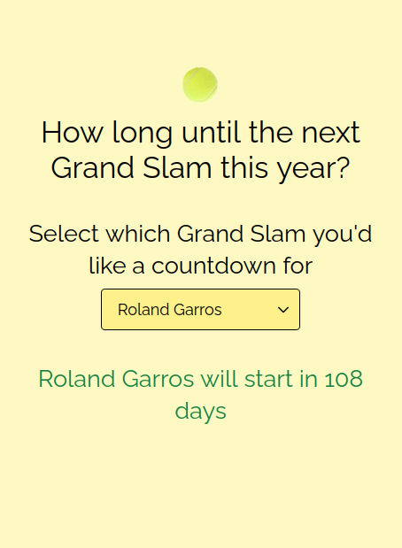

# Grand Slam Countdown

Counting down to tennis Grand Slams

## Table of contents

- [General info](#general-info)
- [Screenshots](#screenshots)
- [Technologies](#technologies)
- [Setup](#setup)
- [Status](#status)

## General info

I wanted something relatively simple to practice Tailwind and Alpine. This was an old repo that I created in 2020... and then most of the Grand Slams didn't happen, so it was useless. Hopefully this will be more useful.

## Screenshots



## Technologies

- Tailwind CSS
- Alpine.js
- Vite

## Setup

To view this project visit the Demo TBC or download the files, open a terminal in that folder and install locally using npm:

```
npm install
```

Update `dates.json` with the dates for this year's Grand Slams.

Then run the app locally:

```
npm run dev
```

## Status

Project is: _in progress_
